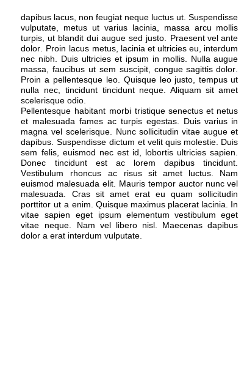

# piltextbox

An extension for the [Pillow (PIL) library](https://pypi.org/project/Pillow/) for streamlined writing of text in an image, with automatic textwrapping and indendation, optional text-block justification, configurable font settings, and basic bold/italic formatting.

### To install
```
pip install Pillow
pip install piltextbox
```

### Quickstart

*Note: The examples below use several of the [Liberation](https://github.com/liberationfonts) fonts, which are not included in this package.*

Text can be [written as lines or paragraphs](https://github.com/JamesPImes/piltextbox#writing-lines-and-paragraphs-optionally-justified), or written [one word at a time](https://github.com/JamesPImes/piltextbox#writing-text-one-word-at-a-time-justification-not-possible). To bold/italicize any or all words, use [formatting codes, along with the `formatting=True` parameter](https://github.com/JamesPImes/piltextbox#writing-formatted-text-bolditalicized) in any of those methods.

#### Writing plain (unformatted) text

The quickstart example code for writing plain text below will write these lines:

```
line_sample = 'The quick brown fox jumped over the lazy dog.'

paragraph_sample = "The lazy dog ignored the fox's rude shenanigans. He had more important things on his mind. For him, the art of napping was not a mark of laziness (a label he rejected), but of an appreciation for the finer things in life: namely, doing nothing."

lorem_ipsum_sample = """Quisque justo quam, auctor ac quam et, porta euismod urna. Ut faucibus lorem non scelerisque imperdiet. In hac habitasse platea dictumst. Mauris non elit orci. Nulla venenatis sit amet metus vitae fermentum. Aliquam erat volutpat. Maecenas sed libero blandit, tincidunt tellus quis, euismod diam. In iaculis est semper odio egestas, a porta augue fringilla. Nulla ut augue non arcu blandit mattis id vel nibh.
Proin neque leo, semper a tempor pharetra, posuere sed neque. Cras egestas non nunc ac pellentesque. Sed fermentum ligula ante, ac finibus ante pulvinar vitae. Donec nec libero sit amet leo convallis dapibus. Nulla a sapien ut arcu posuere tristique nec vitae mauris. Etiam varius odio ac lorem blandit, eu ultricies arcu interdum. Maecenas accumsan tempor dui, a posuere ligula convallis efficitur. Curabitur blandit, augue ac varius pretium, erat risus ultrices libero, ac dictum odio diam quis urna.
Orci varius natoque penatibus et magnis dis parturient montes, nascetur ridiculus mus. Curabitur eleifend dapibus lacus, non feugiat neque luctus ut. Suspendisse vulputate, metus ut varius lacinia, massa arcu mollis turpis, ut blandit dui augue sed justo. Praesent vel ante dolor. Proin lacus metus, lacinia et ultricies eu, interdum nec nibh. Duis ultricies et ipsum in mollis. Nulla augue massa, faucibus ut sem suscipit, congue sagittis dolor. Proin a pellentesque leo. Quisque leo justo, tempus ut nulla nec, tincidunt tincidunt neque. Aliquam sit amet scelerisque odio.
Pellentesque habitant morbi tristique senectus et netus et malesuada fames ac turpis egestas. Duis varius in magna vel scelerisque. Nunc sollicitudin vitae augue et dapibus. Suspendisse dictum et velit quis molestie. Duis sem felis, euismod nec est id, lobortis ultricies sapien. Donec tincidunt est ac lorem dapibus tincidunt. Vestibulum rhoncus ac risus sit amet luctus. Nam euismod malesuada elit. Mauris tempor auctor nunc vel malesuada. Cras sit amet erat eu quam sollicitudin porttitor ut a enim. Quisque maximus placerat lacinia. In vitae sapien eget ipsum elementum vestibulum eget vitae neque. Nam vel libero nisl. Maecenas dapibus dolor a erat interdum vulputate."""
```


##### Writing lines and paragraphs (optionally justified)
```
import piltextbox

# Filepath to the .ttf font we want to use. (If no font is set, it will use
# PIL's default font.)
font_fp = r'testing_fonts\LiberationSans-Regular.ttf'

# a new TextBox object, 400x600 px, using the .ttf font at the filepath,
# size 14 font, with 0 spaces indenting for paragraphs, and 8 spaces for
# every subsequent line. 4 px for vertical line spacing, and margins
# (left-top-right-bottom, specified in px).
tb1 = piltextbox.TextBox(
    (400, 600), typeface=font_fp, font_size=14, paragraph_indent=0,
    new_line_indent=6, spacing=4, margins=(10, 20, 10, 10))

# Write a single line, unjustified. If it can't be fit on a single line,
# gets returned as a list of unwritten text.
unwritten_line_1 = tb1.write_line(line_sample)

# `.write_line()` returns None if the line was written, or a PLine or
# FLine object (which are specialized objects for this module encoding
# unwritten text; PLine is for plain text; FLine is for formatted text).

print(unwritten_line_1)  # prints None, since it was successfully written

# Write a single line, justified.
unwritten_line_2 = tb1.write_line(line_sample, justify=True)

print(unwritten_line_2)  # Was also successfully written, so prints None

# Move the cursor down to the start of the next line (automatically done
# at the end of `.write_line()` -- just demonstrating here that we can
# manually move the cursor down a line).
tb1.next_line_cursor()

# Write the paragraph of text, unjustified. If all lines were successfully
# written, it will return None; however, any lines that could not be
# written are returned as an UnwrittenLines object, which can be passed
# to `.continue_paragraph()` method on another equally configured TextBox
unwrit_lines_1 = tb1.write_paragraph(paragraph_sample)

# Write the paragraph of text, justified. (Linebreaks are respected by
# the text wrap, and lines ending in linebreaks are not justified.)
unwrit_lines_2 = tb1.write_paragraph(paragraph_sample, justify=True)


# Example writing a block of text (as a paragraph) with existing
# linebreaks in it. Each existing linebreak is treated as a soft return,
# moving the cursor down to the next line, but using `new_line_indent`
# and not `pararaph_indent`. (To treat linebreaks as paragraph_indent,
# you'd have to first break your string by linebreak, and pass each
# resulting string one at a time.)

unwrit_lines_3 = tb1.write_paragraph(lorem_ipsum_sample, justify=True)

# Because the last text could not be fit within what remained of the
# textbox, we create a new TextBox object and continue writing. By using
# the `.new_same_as()` method, the new TextBox will automatically use
# the same settings as our original TextBox (which MUST be the case to
# continue writing an UnwrittenLines object, or errors / incorrect
# results are likely).

tb2 = piltextbox.TextBox.new_same_as(tb1)

# Continue writing, to our new TextBox object, again returning any lines
# that can't fit. We have to re-specify whether we want to justify.
unwrit_lines_4 = tb2.continue_paragraph(unwrit_lines_3, justify=True)


# Use the `.render()` method to output a flattened PIL.Image object with
# the margins. (Accessing `tb1.im` would give you the PIL.Image object
# of the writable area only.)
image1 = tb1.render()
image2 = tb2.render()

# -------------------------------------------------------
# Misc. methods for checking how much space is left:

# How many lines can still be written in the TextBox, using the current font:
tb1.lines_left()  # returns 0
tb2.lines_left()  # returns 11

# Whether we're on the last line of the TextBox, using the current font:
tb1.on_last_line()  # returns False
tb2.on_last_line()  # returns False

# Whether the current TextBox is exhausted (i.e. out of room to write,
# using the current font):
tb1.is_exhausted()  # returns True
tb2.is_exhausted()  # returns False
```

**`image1` from the above example:**


**`image2` from the above example:**




#### Writing text one word at a time (justification not possible)

```
import piltextbox

font_fp = r'testing_fonts\LiberationSans-Regular.ttf'

tb3 = piltextbox.TextBox(
    (400, 80), typeface=font_fp, font_size=14, paragraph_indent=0,
    new_line_indent=6, spacing=4, margins=(10, 20, 10, 10))

# Write words, one by one, until there is no room left to write. (Will
# line break as necessary, but afterwards will NOT linebreak.

test_words_1 = 'The quick brown fox'

unwrit_words_1 = tb3.write(test_words_1)
image3 = tb3.render()  # current snapshot of this textbox
```

**`image3` from the above example:**


```
test_words_2 = 'jumped over the lazy dog,'
unwrit_words_2 = tb3.write(test_words_2)
image4 = tb3.render()  # current snapshot of this textbox
```

**`image4` from the above example:**


```
test_words_3 = 'and in so doing, she upset a years-long, fragile truce that locals had feared must one day end.'
unwrit_words_3 = tb3.write(test_words_3)
image5 = tb3.render()  # final snapshot of this textbox
```

**`image5` from the above example:**


#### Writing Formatted Text (Bold/Italicized)

Each of the writing methods discussed above can handle formatted text. However, to do so, there is a bit more housekeeping to do to configure the `TextBox` before starting to write anything. We must first create fonts for `'main'`, `'bold'`, `'ital'`, and `'boldital'`, using the `.set_truetype_font()` method.

```
import piltextbox

# Again using a `Liberation` font to initialize our TextBox
font_fp = r'testing_fonts\LiberationSans-Regular.ttf'

tb4 = piltextbox.TextBox(
    (400, 600), typeface=font_fp, font_size=14, paragraph_indent=0,
    new_line_indent=6, spacing=4, margins=(10, 20, 10, 10))

# Using a `test_fonts` dict is not required; just seems cleaner here.
# These are not included in the `piltextbox` github repo, but can be acquired at
# <https://github.com/liberationfonts/liberation-fonts/releases/tag/2.1.1>
test_fonts = {
    'test_regular': r'testing_fonts\LiberationSans-Regular.ttf',
    'test_bold': r'testing_fonts\LiberationSans-Bold.ttf',
    'test_ital': r'testing_fonts\LiberationSans-Italic.ttf',
    'test_boldital': r'testing_fonts\LiberationSans-BoldItalic.ttf'
}

# First we MUST configure our fonts for 'bold', 'ital', and 'boldital',
# or those stylings will fall back to the 'main' font.

# specifying `style='main'` is redundant here, since it defaults to 'main'.
# (Moreover, in this particular example, 'main' was already set at init
# by specifying `typeface=` and `font_size=`.)
tb4.set_truetype_font(size=14, typeface=test_fonts['test_regular'], style='main')

# Set 'bold', 'ital', and 'boldital' AFTER setting 'main'. (Note that we
# do not need to specify the size after setting it for 'main'.)
tb4.set_truetype_font(typeface=test_fonts['test_bold'], style='bold')
tb4.set_truetype_font(typeface=test_fonts['test_ital'], style='ital')
tb4.set_truetype_font(typeface=test_fonts['test_boldital'], style='boldital')
```

Now we are ready to write formatted text.

```
# Use codes '<b>' and '</b>' for toggling bold.
# Use codes '<i>' and '</i>' for toggling italics.
# Include these format codes within the text string itself; the format
# codes MUST be at word boundaries, and outside of all punctuation.

format_line_sample = 'The <b>quick <i>brown fox</b> jumped</i> over the lazy dog.'
format_paragraph_sample = "The lazy <i><b>dog</b> ignored the</i> <b>fox's rude shenanigans. He had</b> more important things on his mind. For him, the art of napping was not a mark of laziness (a label he rejected), but of an appreciation for the finer things in life: namely, doing nothing."

# We must specify `formatting=True`, or the codes will not be parsed.
tb4.write_line(format_line_sample, formatting=True)
tb4.write_paragraph(format_paragraph_sample, formatting=True)

# Additional linebreak (optional)
tb4.next_line_cursor()

# And we can still `justify=` text with `.write_line()` and `.write_paragraph()`
tb4.write_line(format_line_sample, formatting=True, justify=True)
tb4.write_paragraph(format_paragraph_sample, formatting=True, justify=True)

# Additional linebreak (optional)
tb4.next_line_cursor()

# To parse format codes but discard the resulting formatting, use
# parameter `discard_formatting=True`, in addition to `formatting=True`.
tb4.write_paragraph(
    format_paragraph_sample, formatting=True, discard_formatting=True)

image6 = tb4.render()


```


**`image6` from the above example:**


